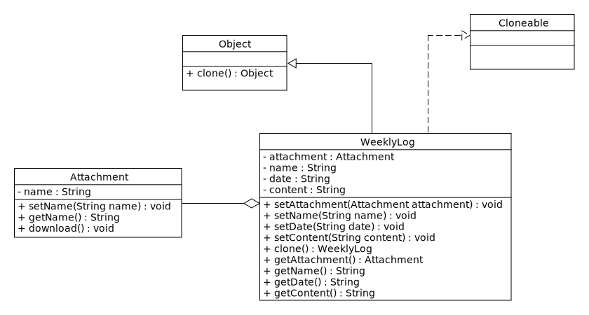

## Prototype (2)

### Implementing the clone operation

A small discussion appears when talking about how deep or shallow a clone should be: a deep clone clones the instance variables in the cloning object while a shallow clone shares the instance variables between the clone and the original. Usually, a shallow clone is enough and very simple, but cloning complex prototypes should use deep clones so the clone and the original are independent, a deep clone needing its components to be the clones of the complex object’s components.

#### Shallow Clone

**Clones only the first level properties**

- [commons-beanutils BeanUtils](https://commons.apache.org/proper/commons-beanutils/javadocs/v1.8.3/apidocs/org/apache/commons/beanutils/BeanUtils.html#cloneBean(java.lang.Object) in most cases
- [Spring BeanUtils](https://docs.spring.io/spring/docs/2.5.6/javadoc-api/org/springframework/beans/BeanUtils.html) if you are already using spring and hence have this utility on the class path

#### Deep Clone

**Clones the entire object hierarchy**

- [commons-lang SerializationUtils](http://commons.apache.org/proper/commons-lang/javadocs/api-release/org/apache/commons/lang3/SerializationUtils.html) Using serialization - if all classes are in your control and you can force implementing `Serializable`
- [Java Deep Cloning Library](https://github.com/kostaskougios/cloning/) Using reflection - in cases when the classes and the objects you want to clone are out of your control ( a 3-rd party library) and you can't make them implementing `Serializable`, or in cases you don't want to implement `Serializable`.

#### Deep Clones vs. Shallow Clones 

when we clone complex objects which contains other objects, we should take care how they are cloned. We can clone contained objects also (deep cloning) or we can the same reference for them, and to share them between cloned container objects (shallow cloning).

#### Shallow Copy Vs Deep Copy in Java

Below is the list of differences between shallow copy and deep copy in java.

| Shallow Copy                                                 | Deep Copy                                                    |
| ------------------------------------------------------------ | ------------------------------------------------------------ |
| Cloned Object and original object are not 100% disjoint.     | Cloned Object and original object are 100% disjoint.         |
| Any changes made to cloned object will be reflected in original object or vice versa. | Any changes made to cloned object will not be reflected in original object or vice versa. |
| Default version of clone method creates the shallow copy of an object. | To create the deep copy of an object, you have to override clone method. |
| Shallow copy is preferred if an object has only primitive fields. | Deep copy is preferred if an object has references to other objects as fields. |
| Shallow copy is fast and also less expensive.                | Deep copy is slow and very expensive.                        |



Below is the example which creates the shallow copy of an object weekly log with an attachment

```java
import java.util.logging.Logger;
class Attachment {
    private String name;
   
    public void setName(String name) {
		this.name = name;
    }
    
    public String getName() {
        return this.name;
    }
    
    public void download() {
		LOGGER.log("Start downloading...")
    }
}
```

```java
class WeeklyLog implements Cloneable {
    
}
```

